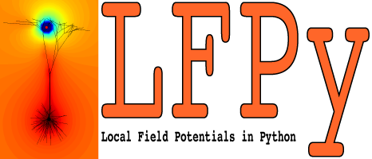

.. LFPy documentation master file, created by
    sphinx-quickstart on Mon Oct  3 13:36:41 2011.
    You can adapt this file completely to your liking, but it should at least
    contain the root `toctree` directive.

Welcome to LFPy's documentation!
================================

(Looking for the old LFPy v1.* documentation? Follow `link <https://lfpy.github.io/v1.3>`_)

Contents
========
.. toctree::
    :maxdepth: 20

    readme.md
    classes

Indices and tables
==================

* :ref:`genindex`
* :ref:`modindex`
* :ref:`search`
