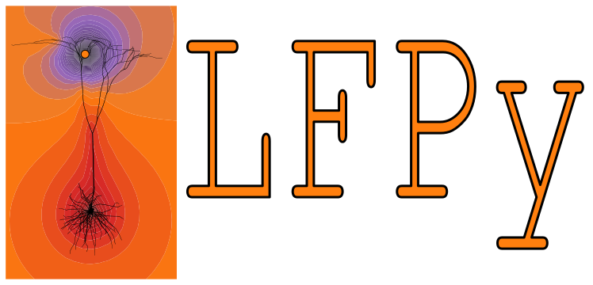

.. LFPy documentation master file, created by
    sphinx-quickstart on Mon Oct  3 13:36:41 2011.
    You can adapt this file completely to your liking, but it should at least
    contain the root `toctree` directive.

Welcome to LFPy's documentation!
================================

A brief video tutorial on LFPy is available here:

.. raw:: html

   <iframe width="560" height="315" src="https://www.youtube.com/embed/gCQkyTHZ1lw" frameborder="0" allowfullscreen></iframe>

======

You can test LFPy online without installation, by clicking this button:

.. figure:: https://nest-simulator.org/TryItOnEBRAINS.png
   :target: https://lab.ebrains.eu/hub/user-redirect/git-pull?repo=https%3A%2F%2Fgithub.com%2FLFPy%2Ftutorial_at_EBRAINS&urlpath=tree%2Ftutorial_at_EBRAINS%2F&branch=main

Note that you might need to be logged into an EBRAINS account for the link to work.
To get a free EBRAINS account, sign up here: https://www.ebrains.eu/page/sign-up

Go to LFPy's source code: https://github.com/LFPy/LFPy

Contents
========
.. toctree::
    :maxdepth: 20

    readme.md
    classes

Indices and tables
==================

* :ref:`genindex`
* :ref:`modindex`
* :ref:`search`
